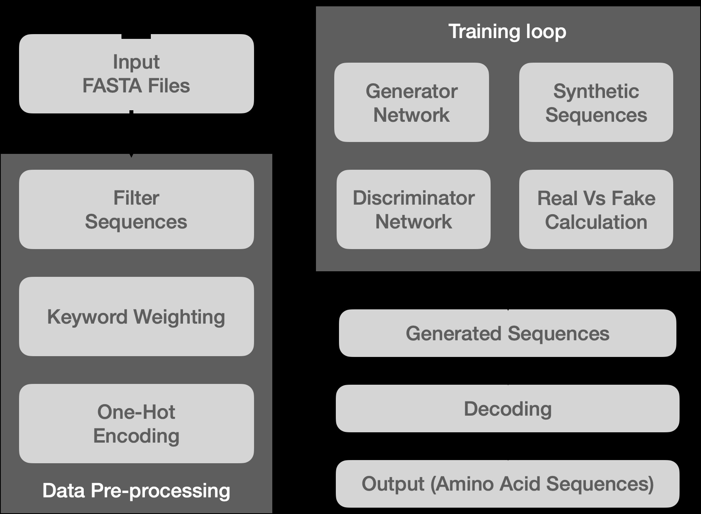

# Synthetic-Protein-GAN

A Generative Adversarial Network (GAN) for generating synthetic protein sequences. This project includes features for customizing the training process by assigning weights to sequences based on keywords in their FASTA headers and filtering sequences by length.

## Features

- **Generative Adversarial Network (GAN)**: Implements a GAN for generating synthetic protein sequences.
- **Keyword-based Sample Weighting**: Assigns higher weights to sequences containing specific keywords in their headers.
- **Length Filtering**: Filters sequences based on minimum and maximum length criteria.
- **Early Stopping**: Includes early stopping to prevent overfitting and optimize training time.

## Installation

To use this project, you will need to have Python installed along with the following libraries:

```bash
pip install -r requirements.txt
```

## Usage

**Clone the repository:**

```bash
git clone https://github.com/schematr0n/synthetic-protein-gan.git
cd synthetic-protein-gan
```

Prepare your FASTA file: Ensure your FASTA file is in the same directory or update the file path in the script.

## Run the script
Modify the script parameters as needed and run the script to train the GAN and generate new sequences.

## Parameters

- **keywords**: List of keywords to assign higher weights to sequences containing these keywords in their headers.
- **weight_factor**: The weight assigned to sequences containing the keywords.
- **min_length**: Minimum length of sequences to include in training.
- **max_length**: Maximum length of sequences to include in training.
- **latent_dim**: Dimension of the latent space for the GAN.
- **batch_size**: Batch size for training.
- **epochs**: Number of epochs for training.
- **patience**: Number of epochs to wait for improvement before early stopping.

## Example

```python
# Define file path and parameters
file_path = 'your_sequences.fasta'  # Path to your plain FASTA file
keywords = ["OS=Homo sapiens", "OS=mus", "OS=ratus"]
weight_factor = 10
min_length = 50  # Minimum length of sequences to keep
max_length = 1000  # Maximum length of sequences to keep
latent_dim = 100
batch_size = 32
epochs = 10000
patience = 10  # Number of epochs to wait for improvement before stopping

# Read and preprocess sequences
sequences, sample_weights = read_fasta_and_weights(file_path, keywords, weight_factor, min_length, max_length)
max_sequence_length = max(len(seq) for seq in sequences)
encoded_sequences = [one_hot_encode_sequence(seq, max_sequence_length) for seq in sequences]
encoded_sequences = np.array(encoded_sequences)

# Build and compile models
generator = build_generator(latent_dim, (max_sequence_length, 20))
discriminator = build_discriminator((max_sequence_length, 20))
discriminator.compile(optimizer='adam', loss='binary_crossentropy', metrics=['accuracy'])

# Define and compile GAN
discriminator.trainable = False
gan_input = Input(shape=(latent_dim,))
fake_data = generator(gan_input)
gan_output = discriminator(fake_data)
gan = Model(gan_input, gan_output)
gan.compile(optimizer='adam', loss='binary_crossentropy')

# Create data generator
data_gen = SequenceDataGenerator(encoded_sequences, sample_weights, batch_size, latent_dim)

# Train GAN with early stopping
train_gan(generator, discriminator, gan, data_gen, latent_dim, epochs, patience)

# Generate and decode new sequences
num_sequences = 10  # Number of new sequences you want to generate
new_sequences = generate_sequences(generator, latent_dim, num_sequences)
decoded_sequences = [decode_one_hot_sequence(seq) for seq in new_sequences]

# Print generated sequences
for seq in decoded_sequences:
    print(seq)
```


### Architecture

```markdown



## Notes
Ensure your FASTA file is properly formatted and contains the relevant keywords in the headers.
Adjust the parameters according to your specific needs and dataset.
The script leverages GPU acceleration if available, which can significantly speed up training.

## License
This project is licensed under the MIT License - see the LICENSE file for details.
